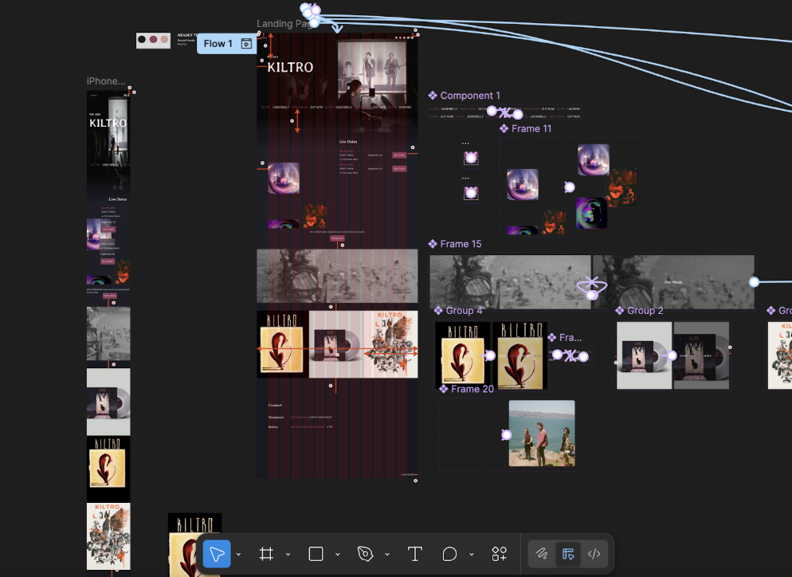
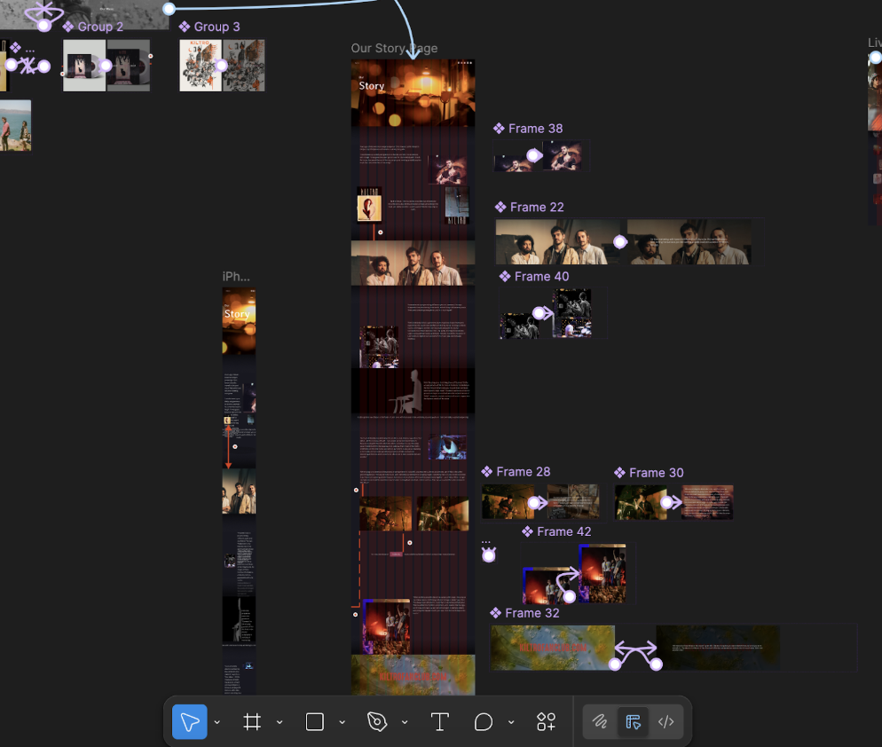
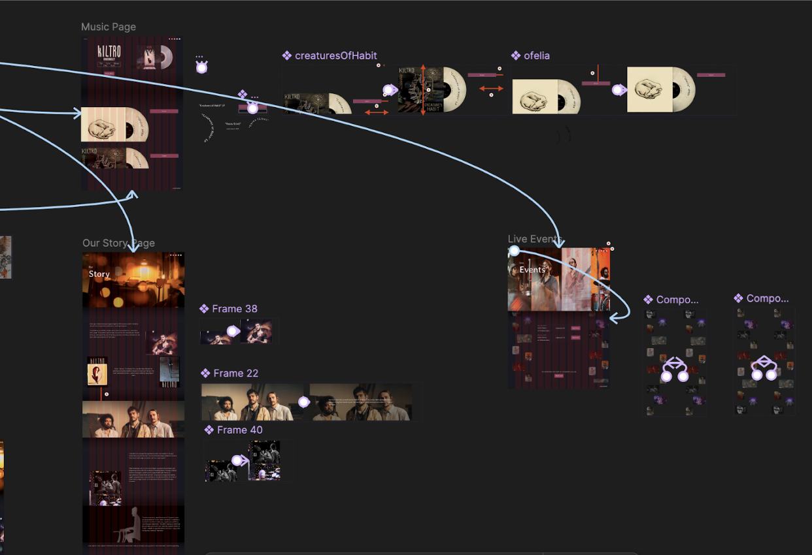

# Kiltro Website

A personal redesign project inspired by the music and visual identity of the band Kiltro.

---

## Overview

The Kiltro Website is a personal redesign project inspired by one of my favourite bands, Kiltro. While exploring their existing website, I felt that it did not fully capture the atmosphere, storytelling, and emotional identity expressed through their music and social media presence.

I designed and developed a completely new website concept that represents their moody, instrumental, and story-driven style. The goal was to create an immersive digital experience that more closely connects their visual identity to their music while providing fans with an easy way to explore upcoming shows and tour information.

---

## Features

- **Custom Frontend Design** — Designed and developed a visually immersive interface inspired by Kiltro's music, Instagram presence, and artistic identity.
- **Responsive Mobile Experience** — Built with dynamic sizing and responsive layouts to provide a seamless experience across desktop, tablet, and mobile devices.
- **Interactive Tour Information** — Developed a backend system to automatically collect and display upcoming tour dates in a clean and accessible format.
- **Automated Data Collection** — Developed a data collection pipeline to gather and organize publicly available tour information.
- **Database Integration (In Progress)** — Currently developing a Supabase-based data management system to efficiently store, organize, and retrieve tour data.

---

## Tech Stack

**Frontend:** HTML, CSS, JavaScript

**Backend:** Python

**Database:** MySQL, Supabase

**Tools:** ScrapeOps

---

## What I Learned / Challenges

One of the biggest challenges of this project was balancing creative design decisions with technical implementation. Creating a website that visually conveyed Kiltro's atmosphere required careful consideration of layout, typography, animations, and responsiveness, while ensuring the experience remained clean and accessible across devices.

Building the backend system introduced new challenges around collecting and managing external data. Developing a scraping solution required researching best practices for handling dynamic websites, organizing scraped information, and ensuring the data could be displayed reliably. 

This project also helped me better understand the importance of separating frontend presentation from backend data management. While the website started as a design-focused project, expanding it into a full-stack application allowed me to explore databases, APIs, automation, and scalable content management.

---

## Roadmap

- [ ] Complete Supabase database integration
- [ ] Improve automated tour data updates

---

## Contact

**Sofia Borodaenko**

Portfolio • [LinkedIn](https://www.linkedin.com/in/sofia-borodaenko/) • [GitHub](https://github.com/sofiaborodaenko)
